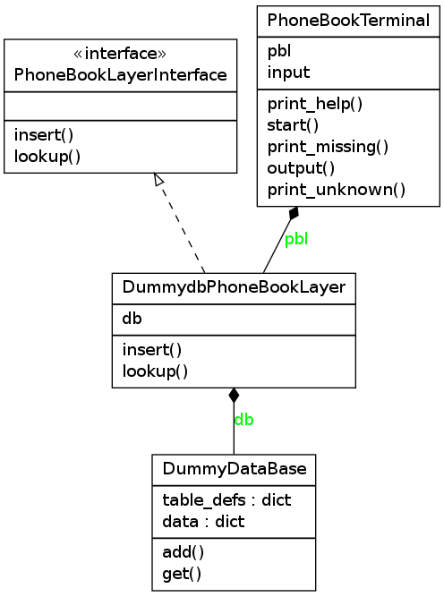

==========================
Unittest tutorial 
==========================
--------------------------------
practical exercise in Python
--------------------------------

:Date: 12-04-2014
:Version: 0.1
:Authors: - Hrobjartur Thorsteinsson 
          - (thorsteinssonh@gmail.com)

Assignment
==========================
Your assignment is to implement a missing
unittest for the **phonebook** package.
Clone the project from google code,

.. code:: bash

	$ git clone http://code.google.com/p/unittesttutorial

Implement the **test_lookup** unit test inside
the file **tests / test_dummydb_phonebook_layer.py**.
Optionally implement the **test_unknown_command** inside
the file **test / test_phonebook_terminal.py**. Note that this second 
test requires a bit more code reading and applies a more
advanced use of the **Mock** class.

If you are interested in what the software does,
try running the **phonebookterminal.py**
( type help for instructions ),

.. code:: bash

	  $ ./phonebookterminal.py
	  
	  PHONE BOOK TERMINAL
	  v0.1.0
	  phonebook: 
	  phonebook: insert Hrobjartur Thorsteinsson;Studlasel 24;4991911
	  phonebook: lookup Hrobjartur Thorsteinsson
	  Hrobjartur Thorsteinsson;Studlasel 24;4991911
	  phonebook: 
	  phonebook: lookup Bolli Palmason
	  None
	  phonebook: exit
	  have a nice day!
	  $

The **phonebookterminal** software allows users to insert
or lookup phonebook entries in a database.

Install software tools
====================================
The essential testing tools are
the mock and nose package for python,

.. code:: bash

	$ sudo apt-get install python-mock
	$ sudo apt-get install python-nose

For some distributions the mock package
is too old, <8.0. Check your version using

    >>> import mock
    >>> mock.__version__

If your version is older than 8.0, you may
want to install the latest version using pip,

.. code:: bash

        $ sudo pip install -U mock
	or
	$ sudo easy_install -U mock

Optionally, if you want to compile
UML diagrams or documentation,

.. code:: bash

	$ sudo apt-get install graphviz
	$ sudo apt-get install pylint
	$ sudo apt-get install python-coverage
	$ sudo apt-get install rst2pdf

Run the tests
======================

The **nose** package includes a 'testrunner' called
**nosetests**.  The testrunner automatically looks up
classes that derive from unittest.TestCase,
executes the tests and reports a result.

Now execute all the tests found in the tests directory,

.. code:: bash

	  $ nosetests -v tests/

All but two tests should pass. Two tests
have been defined but not yet implemented,

.. code:: bash
   
   ERROR: test_lookup (test_dummydb_phonebook_layer.TestPhoneBookLayer)
   ERROR: test_unknown_command (test_phonebook_terminal.TestPhoneBookTerminal)

Optionally use **coverage** to evaluate how well the
tests are 'covering' the code,

.. code:: bash

   $ nosetests -v --with-coverage tests/
   $ coverage report

   Name                                  Stmts   Miss Branch BrMiss  Cover
   -----------------------------------------------------------------------
   phonebook/__init__                        2      0      0      0   100%
   phonebook/dummy_database                 15     10      2      2    29%
   phonebook/dummydb_phonebook_layer        13      4      2      2    60%
   phonebook/phonebook_layer_interface       7      2      0      0    71%
   phonebook/phonebook_terminal             57     28     12      3    55%
   phonebook/version                         4      0      0      0   100%
   -----------------------------------------------------------------------
   TOTAL                                    98     44     16      7    55%

The percentage coverage should improve somewhat after implementing the
new tests.  Note that on some distributions the command line **coverage** tool is called
**coverage2** or **python-coverage**.

Create a git branch
==========================
You may want to create a git branch for your implementation,

.. code:: bash

   $ git checkout -b <my_branch_name>

Later on you may want to push your code back to google code where we
can compare our solutions,

.. code:: bash

   $ git push origin <my_branch_name>

Hróbjartur will supply a username and password.

Handy assert statements and Mock
===================================
The test class provides some basic assert statements, e.g.,

.. code:: python

   def test_something(self):
       self.do_something()
       self.assertEqual(a,b)
       ... or
       self.assertItemsEqual( iterable_a, iterable_b )
       ... or
       self.assertTrue( some_bool )
       ... or
       self.assertRaises( SomeError, self.do_something() )

**Mock** objects also provide some handy
assert statements specific to the mock.  Here we use
**Mock** as a listener, asserting the way it has been called,

.. code:: python

   def test_something(self):
      self.myobj.foo = Mock()
      self.myobj.do_something()
      self.myobj.foo.assert_called_with(some, args)
      ... or
      self.myobj.foo.assert_called_once_with(some, args)
      ... or
      self.myobj.foo.assert_any_call(some, args)

The **assert_any_call** checks if the mock has ever been called
with, while the **assert_called_** check only the last known call
to the mock. Import the **Mock** into a python shell
to see what other options it provides.

We can also make mock provide fake input to your code unit,

.. code:: python

    def test_something(self):
        self.myobj.foo = Mock(return_value="any kind of data")
        ... or if we need a series of calls and return values
	self.myobj.foo = Mock(side_effect=[data1, data2, ...])

Code structure
==========================
The software uses a database abstraction
layer (http://en.wikipedia.org/wiki/Database_abstraction_layer)
to hide the functionality of an actual database module.

An abstraction layer is a 'programming pattern'
that helps isolate your code from external libraries. 
This technique makes your code less dependent 
on those libraries by calling an intermediary layer.

In our case the database module being used is a demonstration
module called **DummyDataBase**. Our abstraction
from this database is called **DummydbPhoneBookLayer**,
which implements an interface **PhoneBookLayerInterface**.
The **PhoneBookTerminal** talks only to the 
**DummydbPhoneBookLayer**, which in turn talks to the
**DummyDataBase**.

Class diagram
++++++++++++++++++++++++++
You can generate a UML class diagram for the code
using **pyreverse** (shippes with pylint),

.. code:: bash

	$ pyreverse -o png phonebook/*.py

